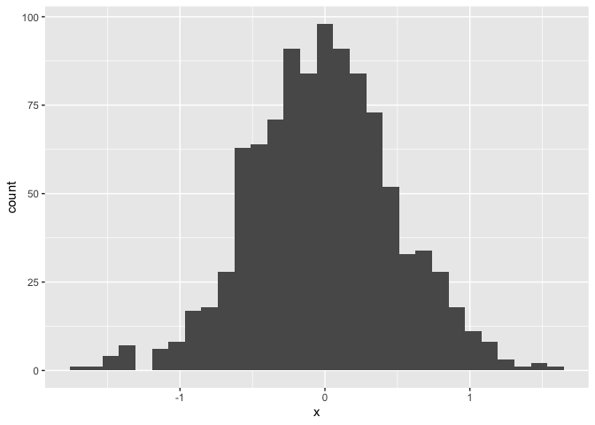
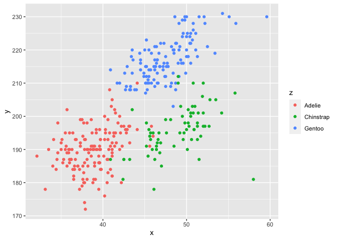

Homework 1
================
Jerry Chao UNI jyc2171
2019-09-17

\#\#This is my solution to Problem 1

Data frame comprised of the specified elements

``` r
US_states_df = 
  tibble(
     Sample = rnorm(10),
     Sample_gt_0 = Sample > 0,
     States = c("New York", "California", "Rhode Island", "Maine", "Missouri", "Connecticut", 
                "New Jersey", "Pennsylvania", "Washington", "South Dakota"),
     Time_zone = factor(c("Eastern", "Pacific", "Eastern", "Eastern", "Central", "Eastern",                                 "Eastern", "Eastern", "Pacific", "Central")),
)
```

Next, I try to take the mean of each variable

``` r
mean(pull(US_states_df, Sample))
```

    ## [1] -0.2618453

``` r
mean(pull(US_states_df, Sample_gt_0))
```

    ## [1] 0.4

``` r
mean(pull(US_states_df, States))
```

    ## Warning in mean.default(pull(US_states_df, States)): argument is not numeric or
    ## logical: returning NA

    ## [1] NA

``` r
mean(pull(US_states_df, Time_zone))
```

    ## Warning in mean.default(pull(US_states_df, Time_zone)): argument is not numeric
    ## or logical: returning NA

    ## [1] NA

I can take the mean of numbers and logical but not character or factor.

``` r
as.numeric(pull(US_states_df, Sample))
```

    ##  [1]  0.3346229 -1.0455105  1.5227132 -0.0458801 -1.5380350 -0.2663475
    ##  [7] -0.3958065 -1.8375902  0.0748709  0.5785102

``` r
as.numeric(pull(US_states_df, Sample_gt_0))
```

    ##  [1] 1 0 1 0 0 0 0 0 1 1

``` r
as.numeric(pull(US_states_df, States))
```

    ## Warning: NAs introduced by coercion

    ##  [1] NA NA NA NA NA NA NA NA NA NA

``` r
as.numeric(pull(US_states_df, Time_zone))
```

    ##  [1] 2 3 2 2 1 2 2 2 3 1

Number, logical, and factor variables can be converted to numbers.
Character variables cannot be converted to numbers.

The purpose of this file is to present a couple of basic plots using
`ggplot`.

First we create a dataframe containing variables for our plots.

``` r
set.seed(1234)

plot_df = tibble(
  x = rnorm(1000, sd = .5),
  y = 1 + 2 * x + rnorm(1000)
)
```

First we show a histogram of the `x` variable.

``` r
ggplot(plot_df, aes(x = x)) + geom_histogram()
```

    ## `stat_bin()` using `bins = 30`. Pick better value with `binwidth`.

<!-- -->

Next we show a scatterplot of `y` vs `x`.

``` r
ggplot(plot_df, aes(x = x, y = y)) + geom_point()
```

<!-- -->
